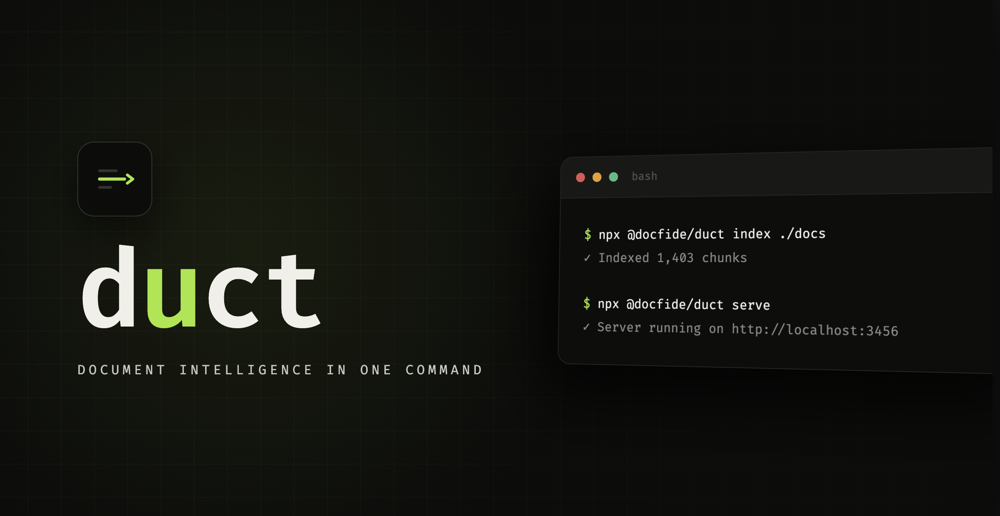

# Duct


**Extract, chunk, embed, search, and ask — document intelligence in one command.**

Duct is an open-source document intelligence pipeline. Point it at a PDF, DOCX, Markdown, image, HTML, or text file (or a whole directory), and it extracts the text, splits it into searchable chunks, and lets you query them instantly — with or without AI embeddings.

```bash
npx @docfide/duct index ./contracts/
npx @docfide/duct search "termination clauses"
npx @docfide/duct ask   "What are my obligations?"
npx @docfide/duct serve   # web UI at http://localhost:3456
```

## Quickstart

```bash
npm install -g @docfide/duct

duct index ./docs
duct search "payment terms"
duct serve
# → http://localhost:3456
```

No API keys required. No configuration files. Works offline.

## Features

| Feature | Description |
|---------|-------------|
| **BM25 Search** | Keyword search out of the box — no API keys, fully offline |
| **Vector Search** | Semantic search via OpenAI or Gemini embeddings |
| **Hybrid Search** | BM25 + Vector blended with Reciprocal Rank Fusion |
| **Re-Ranking** | Second-pass term-proximity scoring for precision |
| **HyDE** | Query expansion via hypothetical document embeddings |
| **Q&A** | Ask questions, get answers with source citations |
| **Agentic Retrieval** | Multi-hop search that decomposes complex questions |
| **Watch Mode** | Auto-index files as they're added or modified |
| **Schema Extraction** | Extract structured fields from documents via LLM |
| **Diff Tracking** | Line-level changes between document versions |
| **Export API** | Search results in JSON or CSV |
| **Web UI** | Tabbed interface for search, ask, upload, and settings |
| **URL Indexing** | Index web pages by URL |
| **Table Extraction** | Detects pipe and whitespace-separated tables |
| **OCR** | Tesseract.js + sharp for scanned PDFs and images |
| **All Formats** | PDF, DOCX, Markdown, HTML, plain text, images |

## Documentation

| Guide | Contents |
|-------|---------|
| [CLI Reference](docs/cli.md) | All commands: index, search, ask, watch, extract, diff, serve |
| [API Reference](docs/api.md) | REST endpoints for the web server |
| [Library API](docs/library.md) | Programmatic usage in Node.js/TypeScript |
| [Search](docs/search.md) | BM25, vector, hybrid, re-ranking, HyDE |
| [Q&A](docs/qa.md) | LLM providers, agentic retrieval, configuration |

## Quick Examples

```bash
# Index and search
duct index ./contracts/
duct search "indemnification clause"
duct search "termination" --search-mode hybrid --rerank

# Ask questions
duct ask "What is the governing law?"
duct ask "Compare all NDAs" --multi

# Watch a directory for changes
duct watch ./inbox --ocr

# Extract structured data
duct extract invoice_date:date:Issue date total:number:Amount --index ./invoices/

# Export results
curl "http://localhost:3456/api/export?q=termination&format=csv"
```

## Environment

| Variable | Required For |
|----------|--------------|
| `OPENAI_API_KEY` | OpenAI embeddings (`text-embedding-3-small` / `3-large`) and LLM (`gpt-4o`) |
| `GEMINI_API_KEY` | Google Gemini embeddings (`text-embedding-004`) and LLM (`gemini-2.0-flash`) |
| `DUCT_AUTH_TOKEN` | Server authentication (alternative to `--auth-token`) |

Without any API key, Duct uses BM25 keyword search — still works, just no semantic understanding. For Q&A, [Ollama](https://ollama.com) is the default LLM provider and runs entirely locally.

## Web UI

```
duct serve
# → http://localhost:3456
```

Four tabs:
- **Search** — search indexed documents with mode badge
- **Ask** — Q&A with configurable LLM, agentic mode toggle
- **Upload** — drag-and-drop files or index by URL
- **Settings** — configure LLM provider, API keys, search mode, chunking

```bash
duct serve --port 8080 --persist .duct-data --auth-token my-secret --llm ollama
```

## Library

```typescript
import { Duct } from '@docfide/duct'

const duct = new Duct({
  chunk: { strategy: 'by-heading', size: 1000 },
  embed: { provider: 'openai' },
  llm: { provider: 'ollama', model: 'llama3.2' },
  search: { mode: 'hybrid', alpha: 0.3, rerank: true },
})

await duct.index('./report.pdf')
const results = await duct.search('termination clause')
const answer = await duct.ask('What are my obligations?')
```

See the [Library API](docs/library.md) for the full API.

## Architecture

```
file.pdf ──┐
file.docx ─┤  extract() → chunk() → embed() → store() → search() → ask()
file.md ───┤           │          │         │          │
file.html ─┤        text      chunks   vectors    results   answer
file.png ───┤           │          │         │          │
file.txt ──┘        pdfjs-dist sliding  OpenAI    BM25     Ollama
                     mammoth    window  Gemini    hybrid   OpenAI
                     marked     by-               rerank   Gemini
                     cheerio    heading            HyDE
                     sharp +
                     tesseract
```

## Deploy

```bash
docker build -t duct .
docker run -d -p 3456:3456 duct
```

See the [Dockerfile](Dockerfile) for build details. Deploy on Railway, Fly.io, or any VPS.

## Development

```bash
git clone https://github.com/docfide/duct
cd duct
npm install
npm run dev          # run CLI with tsx
npm test             # run tests
npm run build        # compile TypeScript
npm run typecheck    # type-check without emitting
```

## License

MIT — see [LICENSE](LICENSE).

---

Built by [Docfide](https://docfide.com). We build contract software; Duct is our gift to developers who work with documents.
